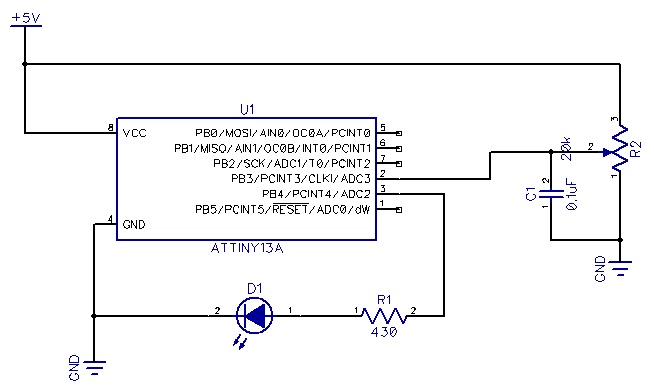
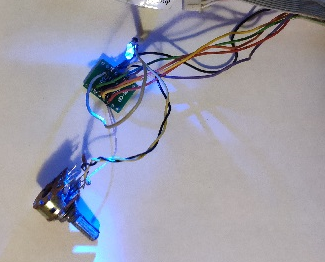

# Attiny13 voltage to frequency

When you need to flash the LED depending on the voltage, you can use this project.
I used to indicate the charge of a lithium battery
In fact, it is a voltage-to-frequency converter.

