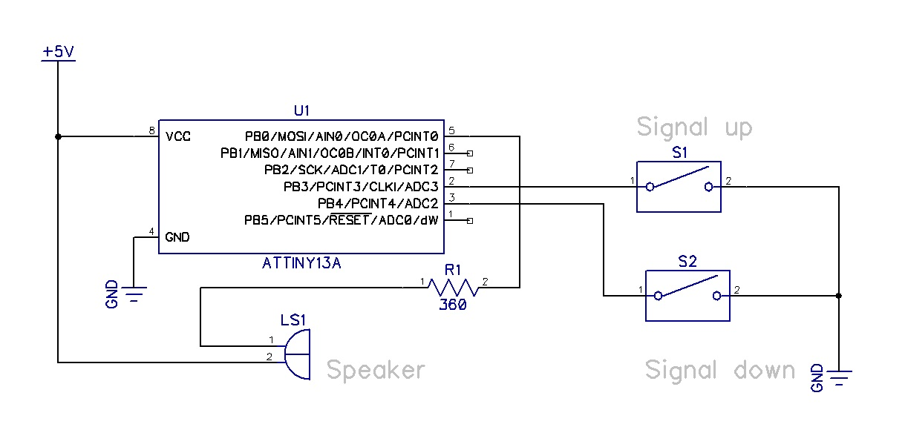
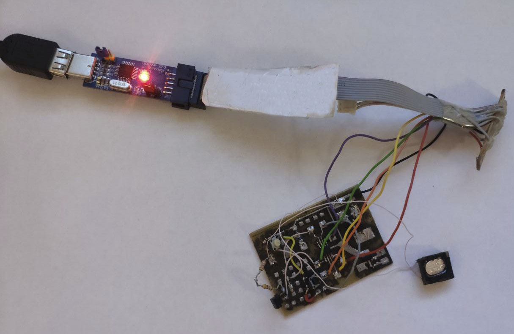
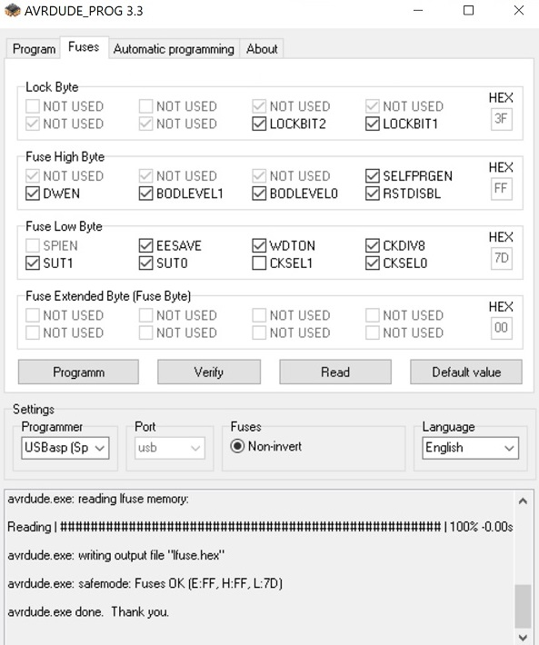

# Attiny13-Generator
Square signal generator base on ATtiny13 avr chip.
Firmware written on C in IDE Microchip Studio 7.02594.
Using two button for change output frequency.
For tests speaker connect to signal pin.

If you change or add interrupts in code. See it name on header file
Program Files\Microchip\xc8\v2.36\dfp\xc8\avr\include\avr\iotn13a.h

