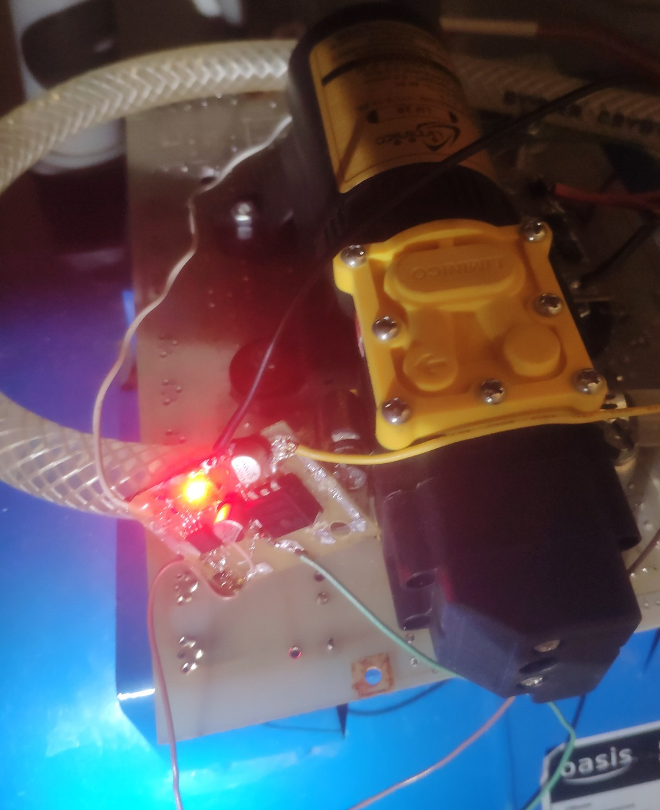

# PumpHysteresis
I bought a water pump(DC 12v 48W), but the pressure sensor works without hysteresis.
I made the shutdown delay 7 seconds. The sensor's rattle is gone.
Pressure 2 bar.
I also added a water level sensor.

