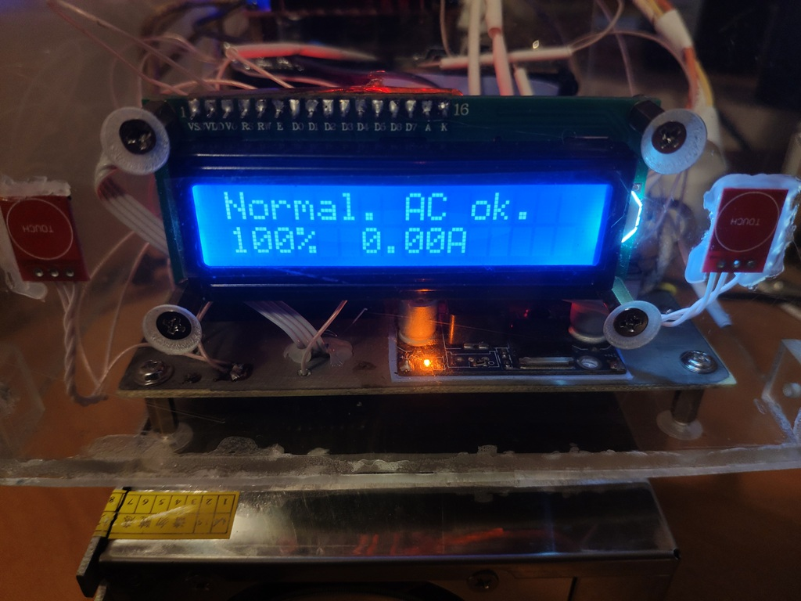

# AvrProjects
Atmel(Microchip) avr projects

# SmartDC_UPS
Uninterruptible Power Supply (UPS) for network equipment.
Developed in PlatformIO, partially built using Arduino modules.
Output: 12V. Backup source: 7S Lithium battery (29V).

[More](./SmartDC_UPS/assets/README.md)

# Attiny13 Generator
Square signal generator base on ATtiny13 avr chip.
Using two button for change output frequency.

[More](./Attiny13-Generator/README.md)

# Pump Hysteresis
I bought a water pump(DC 12v 48W), but the pressure sensor works without hysteresis.
I made the shutdown delay 7 seconds. The sensor's rattle is gone.
Pressure 2 bar.
I also added a water level sensor.

[More](./PumpHysteresis/README.md)

# Attiny13 voltage to frequency

When you need to flash the LED depending on the voltage, you can use this project.

[More](./AdcToFreq/README.md)