# SmartDC_UPS

This Uninterruptible Power Supply (UPS) is designed to support multiple network devices.

    The device features two power outputs:
    "Main Load" for mission-critical hardware.
    "Secondary Load" for less essential devices.

The secondary load is automatically disconnected 5 minutes after switching to battery mode and reconnects 5 seconds after mains power is restored.

Firmware developed in PlatformIO using the Arduino framework.
The firmware implements standard UPS logic, including startup & stabilization Delays. Prevents issues during power transitions. Full control over all voltage levels with automatic shutdown if predefined thresholds are exceeded.
Smart fan speed management based on temperature.
Touch-sensitive buttons allow users to manually toggle loads, which is essential for power-cycling (rebooting) network gear.

The battery pack is built in a 7S2P configuration using 14 power bank cells (10Ah each), resulting in a total capacity of approximately 20Ah.

The figure shows the schematic diagram.
It features an Arduino Nano, two relay modules, and converter modules.

The entire system is powered by a 12V 25A LED power supply.
The output voltage is set to 12.5V to compensate for voltage drops and reduce power losses in the wiring.

An AC output power adapter is used as a mains voltage sensor.
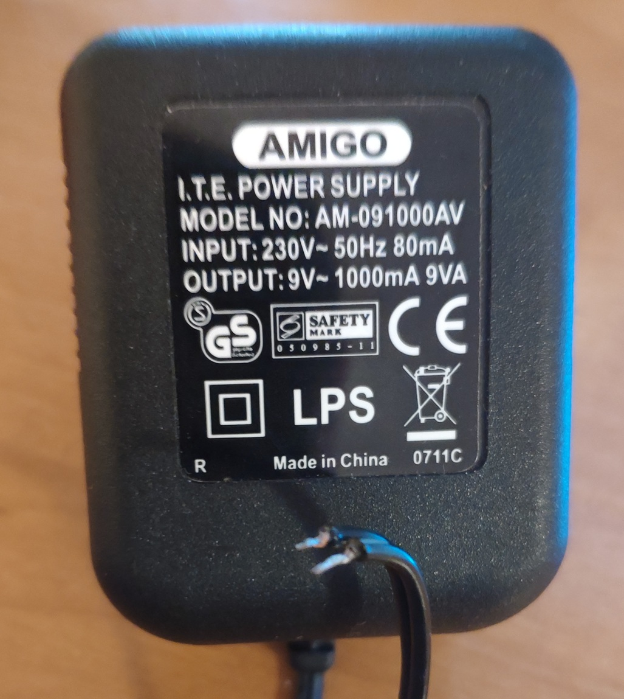

The output voltage is rectified, and the resulting pulsating signal triggers a microcontroller interrupt. This ensures an extremely fast response to
AC power failure.

A red step-up (boost) converter with current control and a diode is used for battery charging.
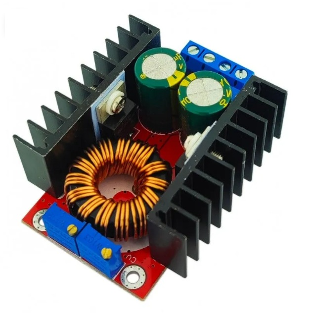
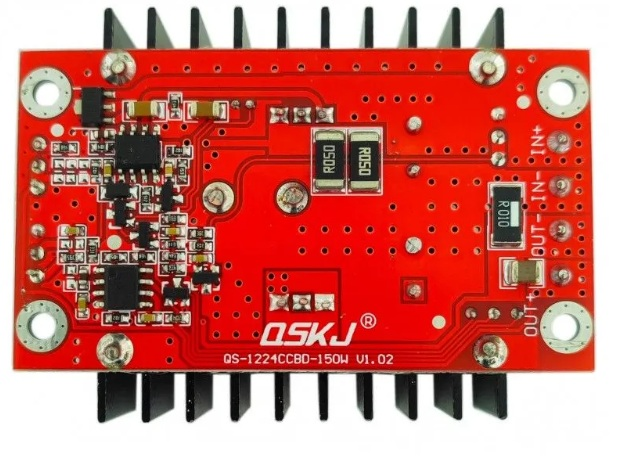

While the voltage of any cell is below 3.3V, the charging current is limited to 0.1A.
Once this threshold is reached, the relay closes and the battery starts charging at 1.5A.
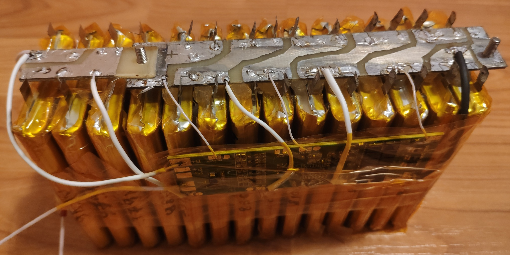

A 600W step-down converter is used to power the load. When mains power is present, it is supplied with 26V from an XL6009E1(12.5->26v) converter. This setup is necessary to keep the input capacitors of the main converter pre-charged, preventing high inrush currents during the switch-over to battery power.

The heatsink temperature is measured by a thermistor attached with UV-curable epoxy. Fan speed is automatically adjusted based on the temperature readings.
The fan speed is controlled by a custom-made driver. As this is a prototype, a single bipolar transistor would have been sufficient.

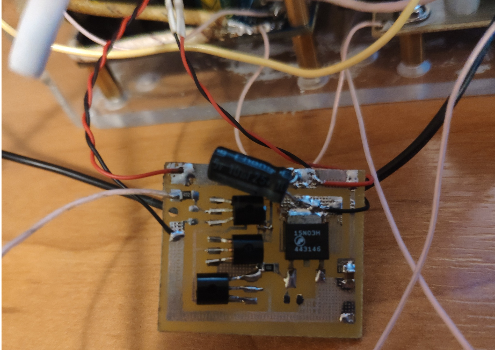
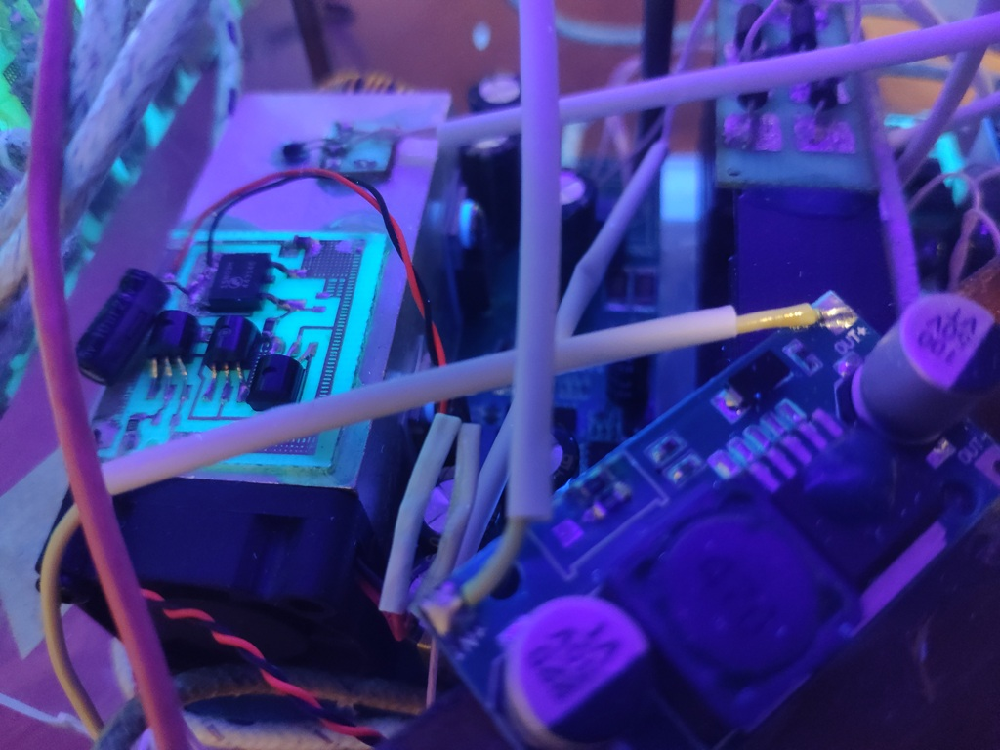
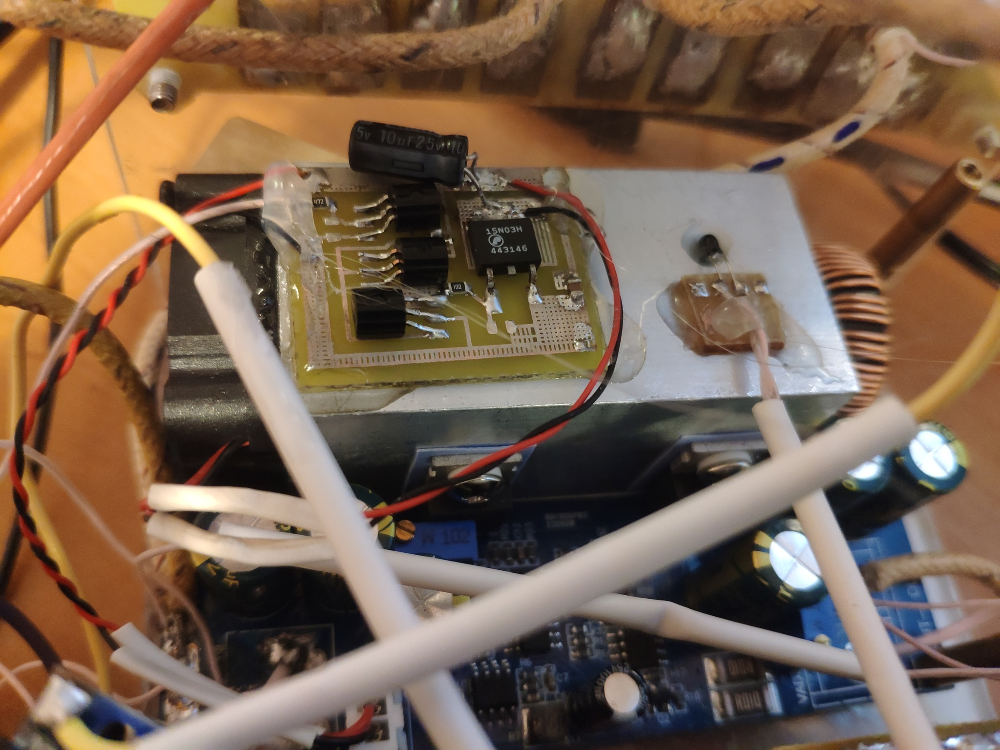

The fan is powered directly from the converter board's connector.

Rear panel view.
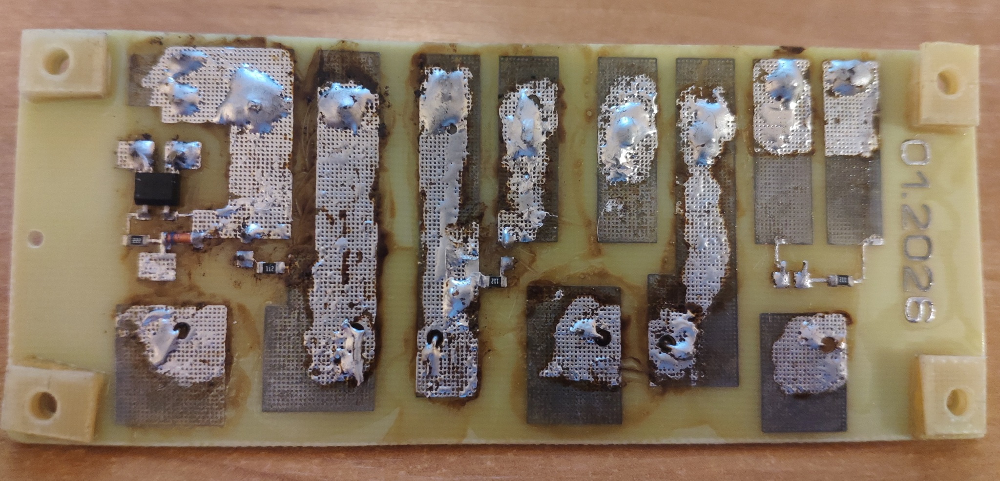
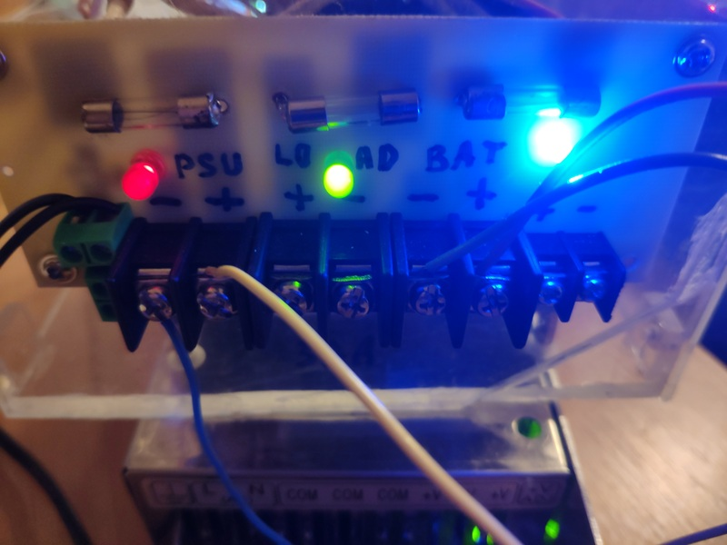

As shown, two loads can be connected.
Each load is controlled by an independent button.
A long press on the touch-sensitive button toggles the corresponding load on or off.
The system defines a Primary and a Secondary load.
The secondary load is automatically disconnected 5 minutes after switching to battery mode.

There is also a ground connection to the minus of the power supply,
and suppressors to prevent the penetration of mosfets in a thunderstorm.
As practice has shown, grounding a negative source is a fairly effective solution.

The Arduino modules are mounted on a custom PCB fabricated using the Toner Transfer Method (laser printer, transfer paper, and a clothes iron).

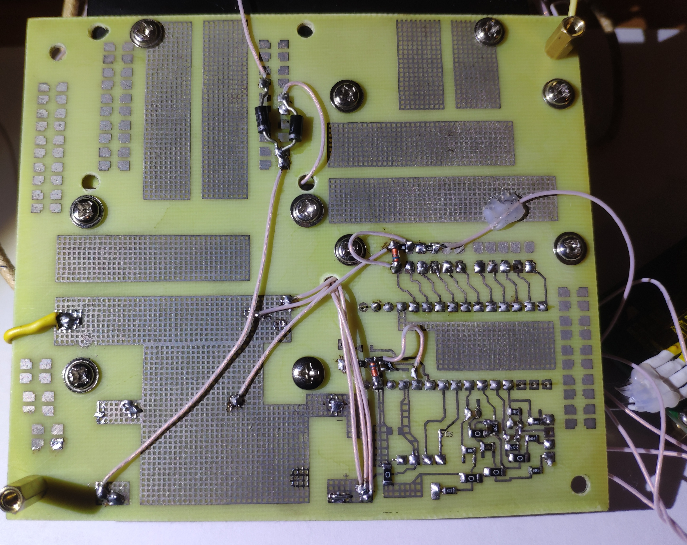

The device is housed in a custom enclosure made from clear polystyrene sheets. The panels were cut with a jigsaw and bonded using a solution of dichloroethane and polystyrene shavings.
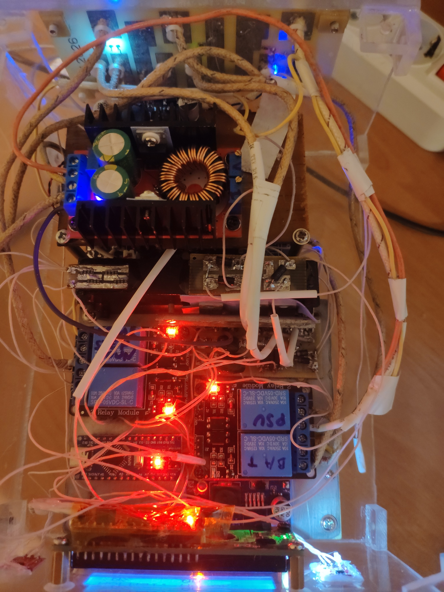

Stand-offs (spacers) are used to mount the boards:

    12mm Hex Spacers (M3)
    2x18mm Round Male-Female Standoffs M3 (total 36mm height)
    11mm Plastic Spacers

Front view of the device.

Proper ventilation on the top and sides is crucial. Without these vents, the converter's heatsink reaches 40°C, triggering the fan and increasing noise levels.

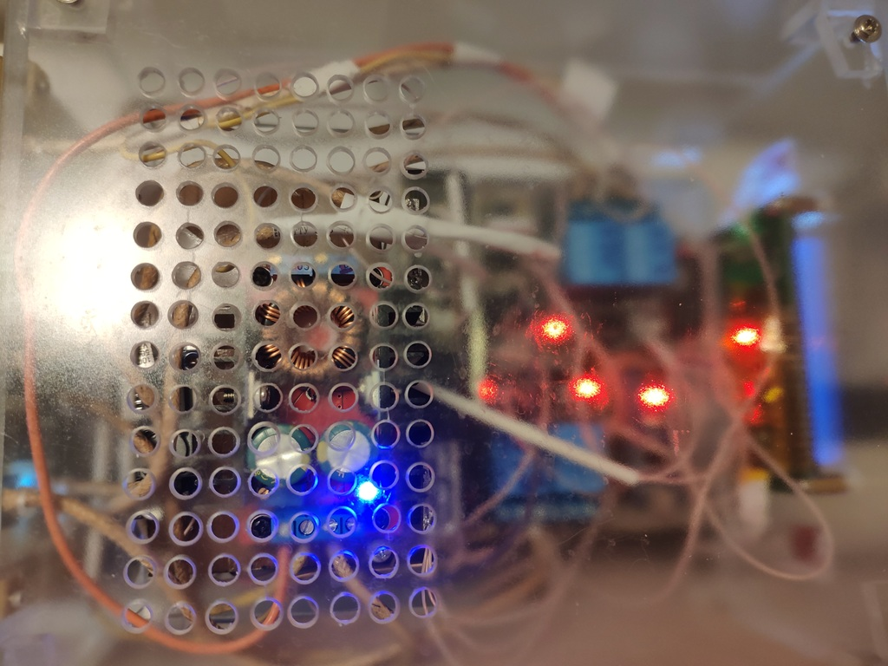

High-resolution photos and detailed wiring diagrams for the relay boards can be found in the project folder.